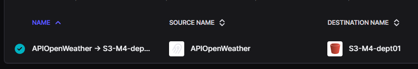

# M4 - ETLT en AWS

---

## Avance I - Diseño ETLT

- Desarrollo de un documento técnico que describa el diseño del pipeline ETLT.

- Proporciona una descripción de la arquitectura, las fuentes de datos utilizadas, detalles del stack tecnológico seleccionado, preguntas de negocio, etc. Además, incluye cuestiones de gobernanza de datos y del ciclo de vida de la información.

- **Diagrama**
 
---

## Avance II - Ingesta → Bronze 

- Se resuelve la ingesta automatizada de datos meteorológicos desde la API de OpenWeather hacia la capa Bronze del Data Lake. Se utiliza Airbyte tanto para la extracción y como para la carga de los datos.

- La ejecución del proceso está programada para realizarse de manera diaria. Dicha ejecución genera archivos que se particionan por fecha y ciudad. 

- Los archivos generados son la base de la siguiente fase la cual tiene como output las capas Silver y Gold.

### Generación de la capa Bronze.

- La capa Bronze es el primer nivel del Data Lake, donde se almacenan los datos en su formato original, casi sin procesar y casi tal cual como son obtenidos de las fuentes externas. 

- Se tienen dos rutas de ingesta de datos:

    - Ingesta automatizada: los datos provenientes de la API de OpenWeather se extraen de manera programada y automática (Airbyte)
    - Ingesta manual: carga de datos históricos vía archivos JSON
 
### 📂 Estructura del bucket en S3


```text
s3://dept01-m4-bronze/
├── api_airbyte/                       # Ingesta automática 
│   └── openweather/                   
│       └── <ciudad>/                  # API2.5OWPatagonia/Riohacha
│           └── year=<YYYY>/           
│               └── month=<MM>/        
│                   └── day=<DD>/      
│                       └── *.parquet  
└── manual_upload/                     # Ingesta manual
    └── city-<ciudad>/          
        └── ingest_date=<YYYY-MM-DD>/  
            └── *.json                 
```
###  ☁️ OpenWeather → S3 Bronze

- Se usa Airbyte Cloud. Despliegue sencillo y ejecución según configuración.

#### 1. Source 

**Conector -->** HTTP API (custom)  
**Endpoint -->** `[GET] https://api.openweathermap.org/data/2.5/weather`  
**Retrieval type:** Synchronous Request

**Parámetros globales**

| Campo | Descripción | Valor |
|--------|--------------|-------------------|
| `api_key` | API key de OpenWeather  | `{{ config['api_key'] }}` |
| `Source name` | Nombre del conector | `APIOpenWeather` ||


#### 2. Streams 

En el conector se definen dos streams, uno para cada ciudad.  
Cada stream invoca al endpoint con los parámetros propios de cada ciudad.  

##### `API2.5OWRiohacha`

- **Parámetros:**
  | Key | Value |
  |-----|--------|
  | `lat` | `11.538415` |
  | `lon` | `-72.916784` |
  | `lang` | `es` |
  | `units` | `metric` |


##### `API2.5OWPatagonia`

- **Parámetros:**
  | Key | Value |
  |-----|--------|
  | `lat` | `-41.810147` |
  | `lon` | `-68.906269` |
  | `lang` | `es` |
  | `units` | `metric` |


#### 3. Destination

**Tipo -->** Amazon S3  
**Versión -->** v1.9.4  
**Bucket --> ** `dept01-m4-bronze `  
**Región -->** `us-east-1`  
**Ruta base -->** `airbyte/openweather/`  
**Formato de salida -->** `Parquet`
**Compresión -->** `SNAPPY` 
**Tamaño de bloque -->** `128 MB`

**Particiones**

| Campo | Valor|
|--------|-------------------|
| `S3 Path Format` | `${STREAM_NAME}/year=${YEAR}/month=${MONTH}/day=${DAY}/` |
| `File Name Pattern` | `{timestamp}_part_{part_number}.parquet` |


#### 4. Conexión

| Parámetro | Valor |
|------------|--------|
| **Connection name** | `APIOpenWeather → S3-M4-dept01` |
| **Schedule type** | CRON |
| **CRON expression** | `0 0 23 * * ?` |
| **Time zone** | `UTC` |
| **Sync mode** | Full Refresh / Append |

- Sobrescribe/agrega según el modo de escritura, según especificación de particiones.




### ✍️ Algunos comentarios
- Variables con valor definido `{{ config[api_key] }}` evitan exponer información sensible directamente en el código.   
- Se optó por el formato Parquet con compresión Snappy por eficiencia en almacenamiento y la velocidad de lectura (posterior) desde Spark en la capa Silver.
- La extracción se ejecuta de manera automática programada por CRON en Airbyte Cloud.

---

## Avance III - Bronze --> Silver/Gold

- En esta etapa del PI se lleva a cabo el procesamiento y modelado de los datos de la capa Bronze en el Data Lake, generando primero la capa intermedia Silver y luego la capa Gold.

- La solución se despliega en la nube de AWS. Los datos se almacenan en Amazon S3, mientras que todo el procesamiento se realiza con Apache Spark ejecutado en contenedores Docker sobre instancias EC2.
    - Infra AWS
         - Amazon S3 (capas bronze/siver/gold).
         - EC2 + Docker (procesamiento con Spark).
         - IAM Role (autenticación segura sin keys para poder acceder a S3).

- Se limpian, normalizan y enriquecen los datos de la capa bronze.
    - [`weather_silver_job.py`](spark-m4/app/weather_silver_job.py) → procesamiento 

- Se generan en la capa Gold, modelos que pretenden responder algunas de las preguntas de negocio planteadas.
    -  [`weather_gold_job.py`](spark-m4/app/weather_gold_job.py) → modelado analítico (dims, facts, algunas respuestas)

- Flujo 
    


## 7. 🗂️ Estructura del proyecto

```text
├── app/
|    ├── wctes/ 
|    |   ├── c_silver.py                   # constantes
|    |   ├── c_gold.py                     # constantes  
|    ├── utils  
|    |   ├── u_silver.py                   # fns para job 
|    |   ├── u_gold.py                     # fns para job
|    ├── weather_silver_job.py             # tf para generar capa silver
|    ├── weather_gold_job.py               # tf para generar capa gold
│
├── conf/                                  # config spark
│   └── spark-defaults.conf                # Parámetros por defecto para sesiones de Spark
│
├── Dockerfile                             # img base y dependencias
├── docker-compose.yml                     # orquestación
├── upload2ec2.sh                          # script local --> ec2  


```
### ⚡Arriba

```bash
# 1)  Crear la magen
docker compose build

# 2) Levantando el servicio
docker compose up -d

```

### 🪣 Estructura de los buckets

```bash
Particionado por city/event_year/event_month/event_day:

s3://dept01-m4-silver/
└── weather/
    └── city=<ciudad>/   #Patagonia/Riohacha              
        └── event_year=YYYY/
            └── event_month=MM/
                └── event_day=DD/
                    └── part-*.snappy.parquet

s3://dept01-m4-gold/
└── weather/
    ├── dim_date/
    ├── dim_city/
    ├── dim_weather_condition/
    ├── fact_weather_hourly/ 
    ├── fact_weather_daily/  
    └── bsq/
        ├── solar_hour_by_month/
        ├── wind_hour_by_month/
        ├── rps_var/
        ├── day_vs_last_year_day/date=YYYY-MM-DD/
        ├── best_days_top/
        ├── worst_days_top/
        ├── htemps_top/
        ├── ltemps_top/
```

## IMPORTANTE

- Los jobs se ejecutan de manera manual. 


```bash

# historicos (silver)
sudo docker exec -it spark bash -lc '
/opt/bitnami/spark/bin/spark-submit \
  /opt/etlt/app/weather_silver_job.py \
  --mode historical_mode \
  --ingest-date 2025-10-22 \
  --shuffle-partitions 4
'
# diario (silver)
sudo docker exec -it spark bash -lc '
/opt/bitnami/spark/bin/spark-submit \
  /opt/etlt/app/weather_silver_job.py \
  --mode day_mode \
  --date 2025-10-23 \
  --shuffle-partitions 4
'

# gold
sudo docker exec -it spark bash -lc '
/opt/bitnami/spark/bin/spark-submit \
  /opt/etlt/app/weather_gold_job.py \
  --years-keep "2024,2025" \
  --cities "Riohacha,Patagonia" \
  --compare-date 2025-10-10 \
  --shuffle-partitions 8 \
  --max-records-per-file 50000
'
```

### 📊 Visualización de algunos resultados

- Potencia solar promedio vs hr 
   

  - Potencia eólica promedio vs hr 
   

  - Potencia solar promedio vs mes 
   

  - Variación porcentual vs referencia
   

  - Temperatura máxima y mínima alcanzadas 
   

  - Temperatura vs mes 
   

  - Top 5 dias calientes y frios
   

  - Potencia solar promedio vs hr 
  
